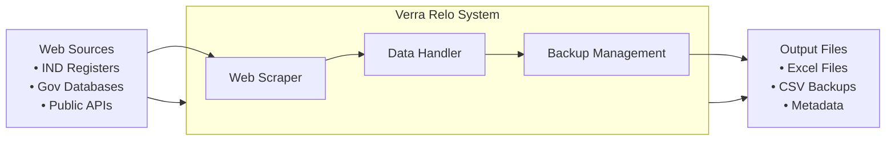
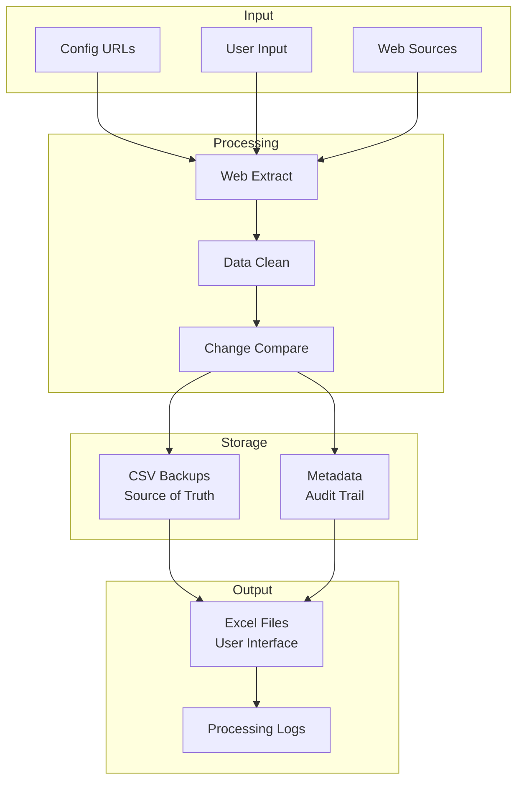

# Verra Relo - Functional Design Document

## Executive Summary

Verra Relo is an automated web scraping solution that monitors websites for tabular data changes, extracts the data, and maintains reliable Excel files with CSV backup integrity. It solves the problem of manual data collection from regulatory databases and public registers while ensuring data integrity through automated backup and recovery mechanisms.

## System Architecture Overview



## Core Business Functions

### 1. Automated Data Collection

- Reads URL configuration and launches browser automation
- Extracts tabular data from websites with business-specific formatting
- Processes data incrementally (only new/changed records)

### 2. Intelligent Data Management

- **CSV as Source of Truth**: Authoritative data in CSV format
- **Excel for Users**: Business-friendly files that preserve custom columns
- **Change Detection**: Compares new data against existing backups

### 3. Data Integrity & Recovery

- **Checksum Validation**: MD5 checksums detect unauthorized changes
- **Automatic Recovery**: Restores Excel files from CSV when tampering detected
- **Audit Trail**: Tracks all changes with timestamps

## User Interaction Guide

### 1. Running the Main Script

**Basic Execution:**

```bash
# Navigate to project directory
cd verra-relo

# Run the main data collection script
python src/main.py
```

**What happens:**

- System reads URLs from `config.json`
- Extracts data from each configured website
- Updates Excel files while preserving custom columns
- Creates/updates CSV backups automatically
- Displays progress and results in terminal

### 2. Managing Data Sources

**Edit Configuration:**

```json
// Edit config.json to add/remove websites
{
  "fetch_urls": [
    {
      "name": "your_data_source",
      "url": "https://example.com/data-page"
    }
  ]
}
```

### 3. Using the Backup Utility

**Check File Status:**

```bash
python src/backup_utility.py list
```

**Verify File Integrity:**

```bash
python src/backup_utility.py check --file "filename.xlsx"
```

**Restore from Backup:**

```bash
python src/backup_utility.py restore --file "filename.xlsx"
```

**Force Restore:**

```bash
python src/backup_utility.py restore --file "filename.xlsx" --force
```

### 4. Working with Excel Files

**Safe Practices:**

- Open Excel files normally for analysis
- Add custom columns for business calculations
- Save files normally - system preserves customizations
- Avoid modifying data columns (first few columns)

**File Locations:**

- Excel files: `data/` directory
- CSV backups: `data/backups/` directory
- Metadata: `data/backups/metadata.json`

### 5. Troubleshooting

**Common Commands:**

```bash
# Check if files are corrupted
python src/backup_utility.py list

# Restore all files from backup
python src/backup_utility.py restore --file "filename.xlsx" --force

# View file integrity details
python src/backup_utility.py check --file "filename.xlsx"
```

## Primary Use Cases

### 1. Daily Data Monitoring (Automated)

- System automatically checks configured websites
- Extracts new data and updates Excel files
- Preserves user's custom columns and formulas
- Generates processing logs

### 2. Business Analysis

- Users work with Excel files for reporting
- Add custom columns for business calculations
- System preserves customizations during updates

### 3. Data Recovery

- Administrator checks file integrity via backup utility
- System restores corrupted files from CSV backup
- Maintains audit trail of all recovery actions

### 4. New Source Configuration

- Add new URLs to configuration file
- System automatically begins monitoring new sources
- Creates appropriate file structure

## Data Flow Architecture



### Key Components:

- **Input**: Configuration files and web sources
- **Processing**: Browser automation, data cleaning, change detection
- **Storage**: CSV backups (source of truth), Excel files (user interface)
- **Output**: Updated files and processing logs

## Business Benefits

- **95% reduction** in manual data collection time
- **Automatic backup** prevents data loss
- **Custom column preservation** maintains user work
- **Integrity checking** detects unauthorized changes
- **Audit trail** supports compliance requirements
